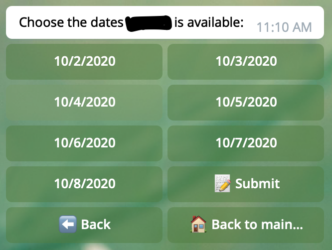
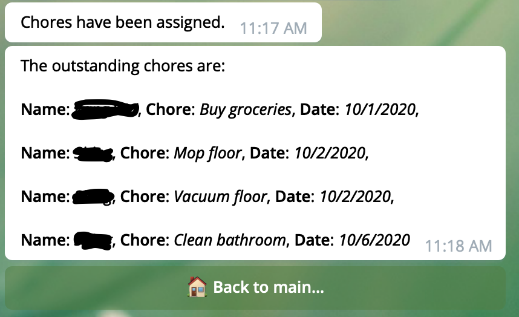

# ChoresBot
Telegram bot to keep track of household chores and its delegation 🏠

## What it does 
* Addition and deletion of common household chores that you want to be monitored
* Addition and deletion of people in the house
* Updating availability of each person
* Assigning of chores to different people based on their availability, frequency of the chore and date the chore was last completed
* Using the ```/random``` command generates a random name among the list of added names 

## How to use it
* Find the bot on telegram and use the ```/start``` command

## Dependencies 
* Telegraf (Telegram bot framework for Node.js)

## Screenshots
The main page ⬇️


The update availability scene ⬇️



The assign chores and outstanding chores scene ⬇️




## What's next?
Telegram bot for deciding who to cook and what to cook for meals [🥞](https://github.com/sittingsotong/crispy-pancake)